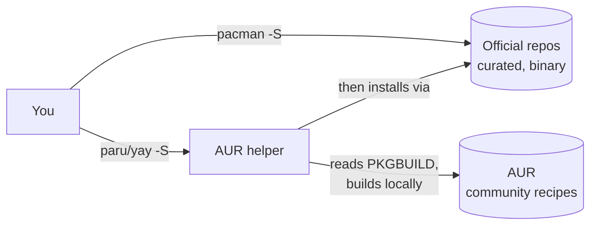

# Arch Linux & pacman

**Goal of this page:** understand what kind of operating system Arch is, why it
behaves differently from Ubuntu, how software gets installed, and what tradeoffs
you've accepted by using it.

## What a "distribution" is

The Linux *kernel* alone is just the part that talks to hardware. To get a usable
operating system you need hundreds of other programs around it: a package
manager, system services, drivers, a shell, utilities. A **distribution**
("distro") is a specific, curated bundle of all that.

Ubuntu, Fedora, Debian, and Arch are all distros built on the same kernel. They
differ in *which* versions they ship, *how often* they update, and *how much*
they decide for you.

## Arch's two defining traits

### 1. Rolling release { #the-rolling-release-bargain }

Most distros do **point releases**: Ubuntu 22.04, then 24.04 — big, infrequent
jumps where everything updates at once, and in between you mostly get security
fixes. Stable, but you're often running year-old software.

Arch is a **rolling release**: there are no versions. You run `pacman -Syu` and
get the newest released version of everything, continuously. The "version" of
Arch is simply *whatever you last updated to*.

| | Point release (Ubuntu) | Rolling release (Arch) |
|---|---|---|
| Software age | Older, battle-tested | Newest, days after upstream |
| Big upgrades | Scary, occasional, all-at-once | None — it's always "now" |
| Breakage risk | Low day-to-day | Higher; an update can break a thing |
| Who fixes breakage | The distro, before you see it | Often *you*, after it lands |

!!! warning "The rolling-release bargain"
    You get the latest features and drivers immediately — which matters for new
    GPUs and Wayland. The price: occasionally an update ships a regression and
    *you* deal with it. This is not hypothetical here — a PipeWire update
    (1.6.6) broke the DualSense controller's audio, and the fix was to **pin**
    that package to the last good version. See the [audio page](../common/audio.md) and
    [troubleshooting](../common/troubleshooting-mindset.md). Building good habits
    (snapshots, reading the news, pinning) is part of running Arch.

### 2. You assemble it

A fresh Arch install is deliberately minimal — kernel, shell, package manager,
not much else. **There is no default desktop.** You choose and install the
display server, window manager, audio system, and apps yourself. That's why this
machine can run Hyprland + caelestia instead of being locked to GNOME: Arch
never made that choice for you.

This is empowering once you understand the layers (which is what the
[Learning Path](../common/index.md) builds), and bewildering before then.

## pacman — the package manager

A **package manager** installs, updates, and removes software and tracks
dependencies, so you never hunt down `.exe` installers. Arch's is `pacman`.

The handful you'll actually use:

```bash
sudo pacman -Syu                 # sync the database + upgrade EVERYTHING (the update)
sudo pacman -S firefox           # install a package
sudo pacman -Rns firefox         # remove it + its now-unused dependencies + config
pacman -Q                        # list everything installed
pacman -Qs nvidia                # search INSTALLED packages
pacman -Ss nvidia                # search the REPOS for available packages
pacman -Qi firefox               # detailed info about an installed package
```

Decoding the flags (they compose, which is why they look cryptic):

- `S` = **s**ync (install/upgrade from repos). `y` = refresh the package
  database. `u` = **u**pgrade installed packages. So `-Syu` = "refresh, then
  upgrade all."
- `R` = **r**emove. `n` = also remove config files. `s` = also remove
  dependencies nothing else needs. `-Rns` = the clean uninstall.
- `Q` = **q**uery the local (installed) database; `s`/`i` = search/info.

!!! danger "Never do a partial upgrade"
    Don't `pacman -Sy <package>` (refresh DB but install just one thing). On a
    rolling release that mixes a fresh package with stale dependencies and can
    break your system. Always `-Syu` — upgrade everything together, or nothing.

### `--needed` and idempotency

`sudo pacman -S --needed <pkgs>` skips anything already installed and
up-to-date. This makes a script **idempotent** — safe to run repeatedly with the
same result. The [install script](../common/reproducibility.md) uses `--needed`
everywhere for exactly this reason.

## The AUR — the Arch User Repository

The official repos don't contain *everything*. The **AUR** is a community
collection of build recipes (`PKGBUILD` files) for software that isn't packaged
officially — `brave-bin`, `claude-desktop-bin`, `anaconda`, the sweet-cursors
theme, and so on.

The AUR doesn't ship binaries; it ships *instructions* to build/install. You
don't want to do that by hand, so you use an **AUR helper** — `yay` or `paru` —
which wraps the whole "download recipe, build, install with pacman" flow:

```bash
paru -S brave-bin        # build/install an AUR package (same feel as pacman -S)
yay  -S anaconda
```

!!! note "AUR safety"
    AUR recipes are *user-submitted*. They're build scripts that run on your
    machine, so in principle a malicious one could do harm. In practice the
    popular packages are heavily watched, but the habit is: glance at a
    `PKGBUILD` before installing something obscure. A fresh Arch install has no
    AUR helper at all — the [install script](../common/reproducibility.md) bootstraps
    `yay` from scratch (clone + build) so the rest of the automation has one.

## Mental model: official repos vs AUR



## Why Arch for *this* machine

The driving reason is the **NVIDIA + Wayland + new-hardware** combination. Wayland
support and GPU drivers improve constantly; a rolling release gets those fixes
months before a point-release distro. The cost — occasional breakage — is
acceptable here because the whole system is [scripted and
reproducible](../common/reproducibility.md): if something breaks badly, rebuilding is a
known, automated path, not a weekend of guesswork.

---

**Next:** [Wayland & Hyprland →](../common/wayland-and-hyprland.md) — how Linux actually
puts windows on your screen.
