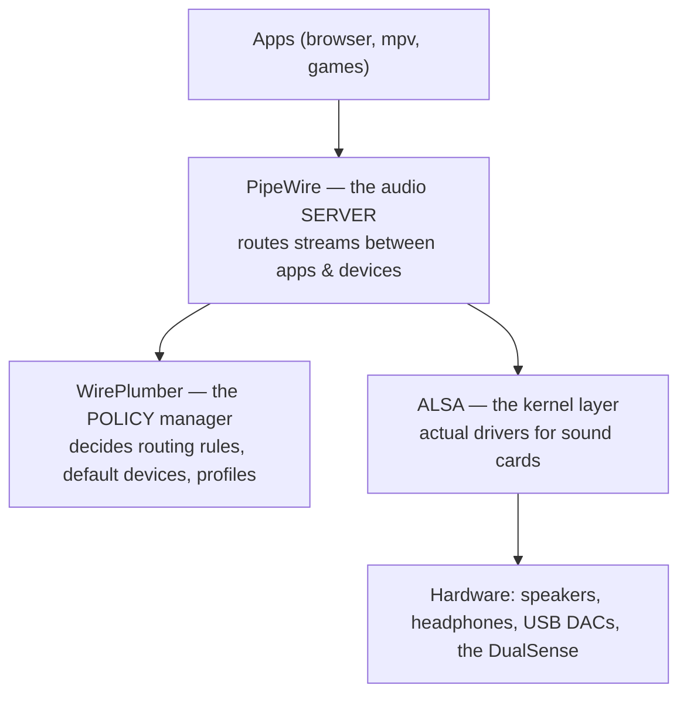

# Audio on Linux

**Goal of this page:** understand the modern Linux audio stack (it confuses
*everyone* at first), the difference between ALSA, PulseAudio, PipeWire, and
WirePlumber, what a "profile" is — then walk a real debugging case study (a
DualSense controller) that shows how to tell a *software* bug from a *hardware*
one.

## The stack, bottom to top

Linux audio is layered, like everything else. Four names you'll meet:



- **ALSA** (Advanced Linux Sound Architecture) is the **kernel** layer — the
  actual device drivers. It's always there. But raw ALSA only lets one app use a
  device at a time and has no concept of "move this stream to headphones."
- **PulseAudio** was the long-time **server** on top of ALSA that added
  per-app volume, device switching, and mixing. Now largely superseded.
- **PipeWire** is the modern replacement for PulseAudio *and* the pro-audio
  system JACK, in one server. It handles audio **and** video streams,
  low-latency routing, and speaks the PulseAudio/JACK protocols so old apps keep
  working. **This machine uses PipeWire.**
- **WirePlumber** is PipeWire's **session/policy manager** — the brain that
  decides *which* device is default, what happens when you plug in headphones,
  and which **profile** a device uses. PipeWire moves the audio; WirePlumber
  decides the rules.

!!! note "Why the split between PipeWire and WirePlumber?"
    PipeWire is a pure, dumb pipe-router — fast and policy-free. WirePlumber holds
    the *opinions* (defaults, auto-switching, per-device rules) in editable
    config. Separating mechanism from policy means you can change behaviour by
    dropping a small config file in, without touching the audio engine. You'll
    see exactly that in the case study.

## Profiles, ports, and UCM

A single audio device often exposes **multiple configurations** it can't all use
at once. A laptop sound card might offer "Stereo Speakers" vs "Headphones." These
are **profiles** — and you can only have one active at a time. Within a profile,
**ports** are the specific outputs/inputs.

Modern USB audio gear is increasingly described by **UCM** (Use Case Manager)
files instead of old-style mixer controls. A UCM device may have *no* ALSA volume
sliders at all — everything is profile/port switching. This matters because the
old "just turn up `PCM Playback Volume` in `alsamixer`" advice simply doesn't
apply to such devices. (The DualSense is one of them.)

## Case study: the DualSense controller's audio

The PlayStation **DualSense** controller is also a USB sound card — it has a
built-in speaker *and* a 3.5mm headphone jack. Two separate problems hit this
machine; together they're a masterclass in audio debugging.

### Problem A — the speaker went silent (a *software* regression)

After a routine `pacman -Syu`, the controller's built-in speaker stopped working.

- **Cause:** the update bumped **PipeWire to 1.6.6**, which shipped a regression
  breaking DualSense USB audio. This is the [rolling-release
  bargain](../arch/arch-and-pacman.md#the-rolling-release-bargain) in action — newest
  isn't always working.
- **Fix:** **pin** the audio stack back to the last good version, **1.6.5**.
  "Pinning" means telling pacman to *ignore* a package during upgrades
  (`IgnorePkg` in `/etc/pacman.conf`) so it can't re-pull the broken version,
  plus downgrading from the local package cache. The
  [install script](reproducibility.md) does this automatically *and only when
  it detects the bad version* — a "self-limiting" fix that's a no-op on a healthy
  system.

!!! tip "A subtle dependency"
    The pin also had to cover `alsa-card-profiles` — a package versioned in
    lockstep with PipeWire that holds profile data, but *not* named `pipewire*`.
    Miss it and the fix is incomplete. The lesson: regressions can hide in
    sibling packages, not just the obvious one.

### Problem B — the headphone jack stayed silent (a *hardware* fault)

Even after fixing the speaker, the 3.5mm jack produced nothing. The temptation is
to keep tweaking software forever. Instead, the problem was **isolated by
elimination** — the core troubleshooting skill:

1. The same earphones worked fine **on a phone** → the earphones are good.
2. The controller's **speaker** worked → the controller's USB audio path is alive.
3. A raw `speaker-test` driving all DAC channels **directly, bypassing
   PipeWire**, produced no sound on the jack → it isn't a routing/PipeWire issue.

With software and the earphones ruled out, only one suspect remained: the
**controller's headphone output stage itself** — a hardware/firmware fault. The
correct conclusion was to *stop chasing it in software*. (Two routing helpers — a
WirePlumber auto-switch rule and a `dualsense-audio` script — were kept anyway,
since they're correct and useful for *working* hardware.)

!!! note "The meta-lesson"
    Problem A was software (and fixable by pinning); Problem B *looked* identical
    ("no sound") but was hardware. The way you tell them apart is **isolation
    testing** — change one variable at a time (different device, bypass a layer)
    until only one explanation survives. That mindset gets its own
    [page](troubleshooting-mindset.md).

## Everyday audio commands

```bash
wpctl status                      # tree of devices, streams, defaults (WirePlumber)
wpctl set-volume @DEFAULT_AUDIO_SINK@ 0.5
pactl list cards short            # cards + their active profiles
pactl list sinks short            # output devices
pavucontrol                       # GUI mixer (per-app volumes, device routing)
```

The [reference](../arch/reference.md#73-audio) has the fuller command set and the
exact DualSense routing recipe.

---

**Next:** [The developer environment →](dev-environment.md) — CUDA matching,
Python environments, and the package philosophy.
