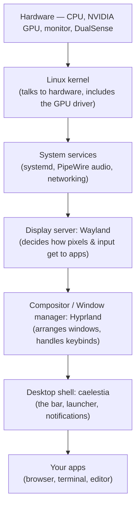

# Start here — the big picture

This page gives you the mental model for everything else. Read it once, slowly.
By the end you'll know *what the pieces are* and *how they stack*, which makes
every later page click into place.

!!! info "This is the shared, distro-neutral core"
    These **Common** pages apply to every build documented here (Arch Linux and
    CachyOS) — the Wayland/Hyprland/caelestia/audio/dev concepts are identical.
    Where a *command* differs by distro it's flagged inline, and the distro-specific
    bits (package repos, the NVIDIA driver model, the bootloader) live in their own
    [Arch](../arch/project-context.md) and [CachyOS](../cachyos/project-context.md)
    sections. Pick your distro on the [home page](../index.md).

## The core idea: Linux is assembled, not pre-built

Windows and macOS are **single products**. One company decides how the desktop
looks, how windows move, where settings live, and ships it as a sealed whole.

Desktop Linux is the opposite. It's a **stack of independent, swappable layers**,
each made by different people, that you (or a distribution) bolt together:

Every box in that diagram is a separate program you could swap for a different
one. That's the source of both Linux's power (*total control*) and its
difficulty (*you have to understand the seams*). This whole site is really just
an explanation of each box and the seams between them.

!!! note "Why so many layers?"
    Each layer does one job and exposes an interface to the next. The kernel
    doesn't know what a "window" is; Hyprland doesn't know how to render a
    pixel to your specific GPU; caelestia doesn't know how to *tile* windows.
    Separation keeps each piece replaceable — but it also means a problem can
    live in any layer, which is why [diagnosing
    issues](troubleshooting-mindset.md) is a skill of its own.

## The four words that scare newcomers

| Word | What it actually means | Read more |
|---|---|---|
| **Arch** | The *distribution* — which gives you the kernel + package manager but no pre-chosen desktop. "Rolling release" = always-latest, no big version jumps. | [Arch & pacman](../arch/arch-and-pacman.md) |
| **Wayland** | The *display server protocol* — the modern rules for how apps put pixels on screen and receive mouse/keyboard input. Replaces the 40-year-old X11. | [Wayland & Hyprland](wayland-and-hyprland.md) |
| **Hyprland** | The *compositor / window manager* — the program that actually arranges windows (here: *tiling*, so windows auto-fit without overlapping) and reads your keybinds. | [Wayland & Hyprland](wayland-and-hyprland.md) |
| **caelestia** | The *desktop shell* — the visible furniture (sidebar, app launcher, notifications, wallpaper) painted on top of Hyprland. | [The caelestia shell](caelestia-shell.md) |

If you remember only one thing: **Hyprland moves windows; caelestia is the
chrome around them; Wayland is the protocol they both speak; Arch is the OS
underneath.**

## How this machine is unusual

Two things make this setup more advanced than a beginner's first install, and
they explain decisions you'll see throughout:

1. **NVIDIA GPU on Wayland.** NVIDIA's Linux drivers were historically the
   awkward fit for Wayland. Most rough edges are gone now, but a few workarounds
   here (the "ghost cursor" fix, abandoning Isaac Sim) trace directly to NVIDIA
   specifics. See [NVIDIA on Linux](../arch/nvidia.md).

2. **A roaming NVMe SSD.** The *same* drive physically moves between a desktop
   (RTX 3060, ultrawide monitor) and a laptop (RTX 4070 Mobile, built-in screen).
   The config has to detect which machine it booted on and adapt — no manual
   edits per swap. See [Reproducibility](reproducibility.md).

## How to read the rest

- Go **in order** the first time. Each page assumes the previous one.
- When a page says "see the [Full Reference](../arch/reference.md)", that's where the
  exhaustive tables and exact commands live — the Learn pages teach the *why*,
  the Reference holds the *what*.
- Hit a word you don't know? The [Glossary](glossary.md) has plain-language
  definitions.
- Everything here is **reproducible**: the [project scripts](../arch/project-context.md)
  can rebuild this exact system, so nothing on this site is "magic you can't
  recreate."

When you're ready, start with [**Arch Linux & pacman →**](../arch/arch-and-pacman.md)
