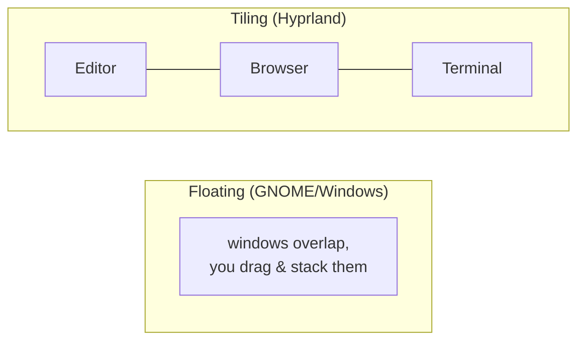

# Wayland & Hyprland

**Goal of this page:** understand how Linux gets windows onto your screen, why
Wayland exists, what a *compositor* and a *tiling window manager* are, and how
Hyprland's keyboard-first model differs from the dock-and-mouse world you know.

## The job: pixels and input

Something has to sit between your applications and your hardware to answer two
questions, constantly:

- **Output:** App windows want to draw. Who decides where each window goes, what
  overlaps what, and how it all becomes one final image sent to the monitor?
- **Input:** You move the mouse and press keys. Who decides which window that
  input belongs to?

That "something" is the **display server**. For ~40 years on Linux it was **X11**
(the X Window System). The modern replacement is **Wayland**.

## X11 vs Wayland — why the switch

X11 was designed in the 1980s for networked terminals. Over decades it grew a
huge, creaky architecture: a central **X server** that every app talks to, with a
separate **window manager** and a separate **compositor** bolted on. Apps could
see each other's input and contents (a security problem), screen tearing was
common, and HiDPI/multi-monitor/mixed-refresh setups were painful.

**Wayland** is a leaner *protocol*, not a big server program. Its key move:
**collapse the X server, window manager, and compositor into one process** called
the **compositor**. That single program receives buffers (finished images) from
apps, arranges them, and produces the screen — and it handles input routing too.

| | X11 | Wayland |
|---|---|---|
| Architecture | X server + WM + compositor (separate) | One **compositor** does it all |
| Tearing | Common without extra config | Tear-free by design |
| Security | Apps can snoop each other | Apps are isolated |
| HiDPI / mixed refresh / per-monitor | Awkward | First-class |
| Age | 1980s, very mature | Modern, still maturing |
| Legacy apps | Native | Run via **XWayland** compatibility layer |

!!! note "XWayland"
    Not every app speaks Wayland yet. **XWayland** is a translation shim that
    runs old X11 apps inside a Wayland session. It mostly "just works," but it's
    the reason some apps look blurry at fractional display scales — see the
    [displays page](displays.md).

## What Hyprland is

**Hyprland is a Wayland compositor** — so it *is* the display server for this
machine. But it's a specific *kind*: a **tiling window manager** with fancy
animations and deep configurability.

### Tiling vs floating

The desktop you know (Windows/macOS/GNOME) is **floating**: windows are free
rectangles you drag, overlap, and resize with the mouse. They pile up like paper
on a desk.

A **tiling** WM treats the screen like a grid. When you open a window, it
automatically takes a slice of the available space; open another and the space
*splits* to fit both — no overlapping, no manual placement. You navigate and
resize with the **keyboard**.

The payoff: no time lost arranging windows or hunting for a buried one. The cost:
a learning curve, and you must *know the keybinds* because nothing is clickable
to discover. (This site's [keybinds reference](../arch/keybinds.md) is your map.)

## The keyboard-first model

In a tiling WM the **keybind is the interface**. Instead of a dock you pin apps
to, you bind Super+a letter and launch with one press.
Instead of clicking a window, you move focus with Super+arrow.

- Super is the "logo"/Windows key — the WM's dedicated
  modifier so its shortcuts never clash with app shortcuts.
- Most-used apps sit on a single Super+letter (W =
  browser, C = code, E = files, T = terminal).
- Everything else lives on Super+Shift+letter.
- Super+Space opens a
  fuzzy-search launcher: type a few letters of any app, press Enter. Often faster
  than finding an icon.

**Workspaces** replace a crowded taskbar: Super+1..9
jump between virtual screens, each holding its own windows. Coming from Ubuntu?
The [Coming from Ubuntu](coming-from-ubuntu.md) guide maps every old habit to
its new equivalent.

!!! tip "Discoverability is the real adjustment"
    Floating desktops are *discoverable* — you can see and click everything. A
    tiling WM trades that for speed: nothing announces what's possible, so you
    lean on a cheat-sheet at first. After a week the muscle memory forms and the
    keyboard model is genuinely faster for most work.

## Where Hyprland is configured

Hyprland reads plain-text config files (`.conf`). On this machine those files are
managed by the **caelestia** shell's tree, with your personal overrides layered
on top in a very specific way — that layering is important enough to get
[its own page](caelestia-shell.md). For now, the key facts:

- Config is text you edit, then reload (`hyprctl reload`, or caelestia
  auto-reloads on save).
- `hyprctl` is the command-line remote control for a running Hyprland — query
  state (`hyprctl monitors`, `hyprctl binds`) or change settings live
  (`hyprctl keyword ...`) without restarting.

---

**Next:** [The caelestia shell →](caelestia-shell.md) — the bar, launcher, and
the config-override rule you must not break.
