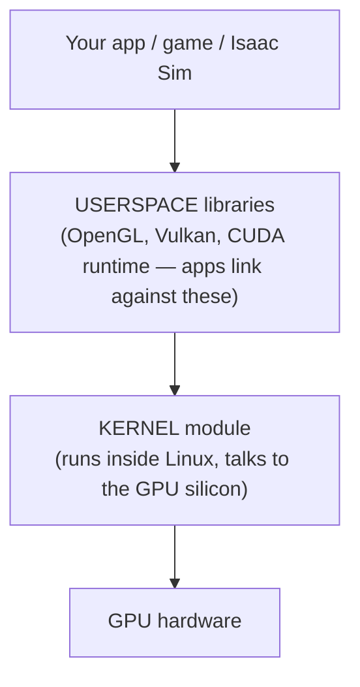

# NVIDIA on Linux

**Goal of this page:** understand what a GPU driver actually is, the difference
between the driver options (`nouveau`, `nvidia`, `nvidia-open`), the crucial
**kernel vs userspace** split, what CUDA is, and why NVIDIA has historically been
the tricky vendor on Linux — illustrated by two real problems this machine hit.

## What a "driver" is

Your GPU is a separate computer on a card. The OS can't use it without a
**driver** — software that translates generic requests ("draw these triangles,"
"run this compute kernel") into the exact commands *this* GPU understands. No
driver, no acceleration (and often no display at all beyond a basic fallback).

## The three NVIDIA driver options

| Driver | Who makes it | Notes |
|---|---|---|
| **nouveau** | Community (reverse-engineered) | Fully open, ships in the kernel, but slow and incomplete for modern cards — fine for a console, not for gaming/CUDA. |
| **nvidia** (proprietary) | NVIDIA, closed-source | Full performance + CUDA. The long-time default; the historical source of Wayland friction. |
| **nvidia-open** | NVIDIA, open kernel modules | NVIDIA's open-source *kernel* modules (the userspace stays closed). Recommended for recent GPUs (Turing and newer). **This machine uses `nvidia-open`.** |

`nvidia-open` is not the same as `nouveau`: it's NVIDIA's *own* code, just with
the kernel-level part open-sourced. You get full performance and CUDA, plus
better long-term kernel compatibility.

## Kernel module vs userspace — the split that explains everything

An NVIDIA driver is really **two pieces**:



- The **kernel module** is loaded into Linux itself and is what actually
  commands the silicon. There is exactly **one**, shared by everything.
- The **userspace libraries** are what apps link to (Vulkan for rendering, the
  CUDA runtime for compute).

This split is the single most useful idea for diagnosing NVIDIA problems,
because **a bug in the kernel module cannot be fixed by swapping userspace** —
and that's exactly what bit the Isaac Sim attempt below.

## What CUDA is

**CUDA** is NVIDIA's platform for running general computation (not just
graphics) on the GPU — the backbone of modern ML/AI and scientific computing.
Practically it's a toolkit (`nvcc` compiler, libraries) plus a runtime that talks
to the driver.

The key gotcha, which the [install script](07-dev-environment.md) automates:
**your driver caps the maximum CUDA version you can use.** `nvidia-smi` shows a
"CUDA Version" — that's the *highest* CUDA the installed driver supports, not
what's installed. Install a CUDA newer than that ceiling and it won't run. The
[dev environment page](07-dev-environment.md) explains the matching logic.

## Why NVIDIA was "the hard one" on Wayland

For years the proprietary driver didn't implement the standard buffer-sharing
mechanisms Wayland compositors expected (it used its own, `EGLStreams`). So
Wayland on NVIDIA meant glitches, black screens, and broken apps, while AMD/Intel
(open drivers) worked smoothly. Most of that gap has closed — the driver now
supports the standard path, and compositors like Hyprland run well on NVIDIA. But
a few sharp edges remain, and this machine met two of them.

## Case study 1: the "ghost cursor"

**Symptom:** a mouse cursor frozen at screen centre that survived reboots,
unplugging devices, and disabling every input — clearly *not* an input device.

**Root cause:** an NVIDIA **software-cursor rendering artifact**. The fix is a
specific Hyprland cursor config — a CPU cursor buffer *with* hardware cursors
left enabled:

```ini
cursor {
    no_hardware_cursors = false
    use_cpu_buffer = true
}
```

Counterintuitively, forcing `no_hardware_cursors = true` *caused* the stale
cursor. (A *second*, unrelated cause existed too — the DualSense touchpad
registering as an absolute pointer — fixed separately with a udev rule.) The full
write-up with both causes is in the
[reference](../reference.md#87-two-mouse-cursors-one-moving-one-stuck-at-centre).
This is a textbook example of "the obvious explanation (an input device) was
wrong; the real cause was a layer down (the renderer)."

## Case study 2: Isaac Sim, and a bug a container couldn't fix

**Isaac Sim** is NVIDIA's robotics simulator. The attempt to run it here failed
in a way that's deeply instructive about the [kernel/userspace
split](#kernel-module-vs-userspace-the-split-that-explains-everything).

- First it was tried in a Python/conda environment. That broke repeatedly on
  Arch's rolling **userspace** (library version mismatches) — a fixable class of
  problem.
- Then the **RTX renderer segfaulted** (crashed) whenever it built a 3D scene, on
  this box's NVIDIA **595** driver. A non-rendering compatibility check passed;
  actual rendering crashed.
- The textbook fix for "Arch userspace mismatch" is a **container** (Docker) —
  it ships a matched, frozen userspace. So Isaac was moved into the official
  Docker container... and it **still crashed the same way**.

Why? Because a container replaces *userspace* but **shares the host's kernel
driver**. The container can't give Isaac a different driver than the host — the
NVIDIA Container Toolkit deliberately *injects the host driver* into the
container. So the crash followed it in.

**The refined diagnosis (the important bit):** this is not a hardware limit and
not an unfixable bug — it's a **driver-version mismatch**. The decisive evidence:
the *same* GPU runs Isaac Sim fine on this machine's separate **Ubuntu SSD**.
Isaac Sim 5.1 validates NVIDIA driver **580**; Arch ships **595** (newer, not
validated). Newer is not always better — simulators pin to the driver they were
tested against.

!!! note "The lesson"
    When a container *doesn't* fix a "userspace" problem, suspect the kernel
    layer — here, the driver *version*. The layers diagram at the top of this page
    is the tool: match the symptom to the layer, and you stop fixing the wrong one.

### The fix: switch the whole NVIDIA stack to the validated driver

**Outcome: this worked — Isaac Sim *and* Isaac Lab now run on this machine.**
Getting there taught several lessons worth keeping.

Because the userspace driver (`nvidia-utils`) is a single **global** version
shared by every kernel, you can't run 595 for the desktop and 580 for Isaac at
the same time — going to 580 means the *whole system* runs on 580 until you
switch back. And the 580 driver won't compile against a bleeding-edge kernel, so
the switch also installs the **`linux-lts`** kernel and boots that for robotics.

> **Lesson — "older driver" needs an old-*enough* kernel.** The first try used
> driver **580.76.05**, and its DKMS module **failed to build** against `linux-lts`
> 6.18 (a kernel DRM API had changed). `linux-lts` was itself too new for that
> driver. The fix was the *newest* 580 (**580.119.02**), whose source has the
> conftest for the new API. So "pin to the validated branch" really means "newest
> point release *of* that branch."

That's a lot of moving parts, and getting it wrong can leave you at a black
screen (NVIDIA drives the display). So it's automated in a dedicated, reversible
tool, `nvidia-switch.sh`:

```bash
nvidia-switch.sh status      # report driver / kernels / CUDA / pins / boot default
nvidia-switch.sh downgrade   # whole stack -> 580.119 (+ linux-lts), atomically
nvidia-switch.sh latest      # restore the repo-newest driver, boot back into linux
nvidia-switch.sh cuda        # align CUDA/cuDNN to the loaded driver (post-reboot)
nvidia-switch.sh purge       # remove everything NVIDIA (TTY/recovery only)
```

What makes it safe:

- **One atomic transaction** for the package swap — the system is never left
  without a driver mid-step.
- It **verifies the DKMS module actually built** before it touches the
  bootloader. (This is the check that would have caught the 580.76 failure
  *before* a reboot into a driverless kernel — see the lesson above.)
- It **pins** the result (`IgnorePkg`) so a routine `pacman -Syu` can't silently
  pull you back to 595.
- It's **bootloader-aware.** This machine boots a **Unified Kernel Image** under
  the **Limine** bootloader (not systemd-boot — an early assumption that was
  wrong and only showed *one* boot entry). Limine doesn't auto-discover UKIs, so
  the tool also writes a UKI for `linux-lts` and adds a Limine menu entry +
  default for it.
- It **reclaims space**: old driver/CUDA versions are pruned from the pacman
  cache (the installed tree never keeps duplicates — pacman replaces in place).

**A CUDA subtlety:** the driver caps the maximum CUDA version (`nvidia-smi`'s
"CUDA Version"). 580 caps at 13.0, but the repo toolkit was 13.2 — and that's
*fine*, because **CUDA minor-version compatibility** lets a newer-minor toolkit
run on an older-minor driver of the same major (13.x). So the `cuda` action keeps
13.2 rather than forcing a needless downgrade; it only swaps when the *major*
version exceeds the driver's ceiling. Run it after rebooting (the ceiling is only
readable once the new driver is loaded). See the
[dev environment page](07-dev-environment.md#robotics-isaac-sim-ros-2) and the
[reproducibility page](08-reproducibility.md).

## Practical NVIDIA commands

```bash
nvidia-smi                 # driver version, GPU model, max supported CUDA, usage
pacman -Qs nvidia          # which NVIDIA packages are installed
hyprctl monitors           # confirm the compositor sees the GPU's outputs
```

---

**Next:** [Audio on Linux →](06-audio.md) — the modern sound stack, and a real
debugging story.
