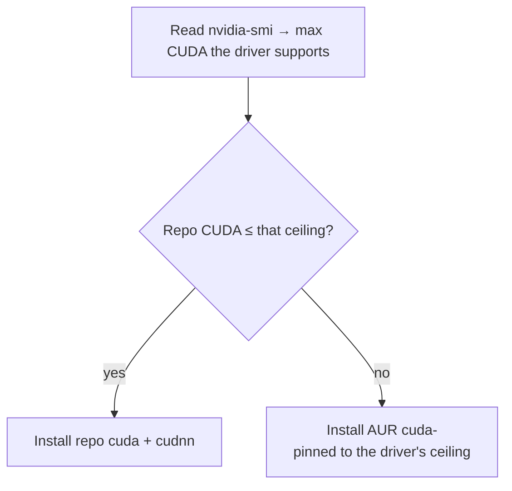

# The developer environment

**Goal of this page:** understand how this machine is set up for development —
especially the GPU/CUDA toolchain and Python — and the philosophy behind *which*
tools get installed where.

This box is a robotics / ML / embedded development machine, so the dev setup is
substantial. The [install reference](../reference.md#6-installed-software)
lists every package; this page explains the *reasoning*.

## CUDA, matched to the driver

[Recall from the NVIDIA page](05-nvidia.md#what-cuda-is): your installed driver
sets a **ceiling** on which CUDA version can run. Install a CUDA newer than the
driver supports and it simply won't work.

Arch's repo `cuda` package is *rolling* — always the newest CUDA, which may need
a newer driver than you have. So the install script is clever about it:



This means a fresh install gets a *working* CUDA automatically, instead of the
newest one that might fail to load. **cuDNN** (NVIDIA's deep-learning primitives
library) is installed alongside. The PATH is wired so `nvcc` and friends are
found in both login shells and fish. The exact logic is in
[`install_cuda`](08-reproducibility.md).

> **Minor-version compatibility — the ceiling is a *major*-version rule.** A
> CUDA **13.2** toolkit runs fine on a driver that maxes out at **13.0**, because
> CUDA guarantees that a newer-*minor* toolkit works on an older-minor driver of
> the **same major** (13.x). So after switching the driver to 580 (whose ceiling
> is 13.0), there's no need to downgrade the 13.2 toolkit — `nvidia-switch.sh
> cuda` only swaps CUDA when the *major* version exceeds the ceiling. (An earlier
> over-aggressive version *did* try to force 13.0 and removed `opencl-nvidia` —
> a driver component — in the process; the lesson: don't fight the package
> manager for a minor version that's already compatible.)

## Python: system, venv, or conda?

Python on Linux has a famous footgun: the OS itself uses Python, so installing
packages globally with `pip` can break system tools. There are three sane
approaches, and this machine uses a mix deliberately:

| Approach | What it is | Used here for |
|---|---|---|
| **System packages** | `pacman -S python-numpy ...` — distro-packaged libs | The everyday scientific stack (numpy, scipy, pandas, scikit-learn, jupyter), so they're managed by pacman like everything else |
| **venv** | A lightweight per-project virtual environment (`python -m venv`) | Isolating a single project's dependencies |
| **Anaconda / conda** | A separate Python distribution with its own package manager + environments | General ML/Python work needing its own toolchains, kept independent of the system Python |

!!! note "Why both system packages and Anaconda?"
    The system stack (via pacman) keeps common libraries fast to install and
    centrally updated. **Anaconda** is installed separately for ML workflows that
    want their own isolated environments and binary toolchains — it's wired into
    fish via `conda init`, but configured **not** to auto-activate its `base`
    environment (so your shell doesn't silently start inside conda). You opt in
    with `conda activate`. Anaconda is general-purpose here; it is *not* tied to
    any one project (the abandoned Isaac Sim attempt once used conda, but
    Anaconda outlived it).

## The package philosophy

A glance at the [installed software](../reference.md#6-installed-software)
shows the categories: build tools (clang, cmake, ninja, gdb), the Python stack,
Node, editors (Neovim, VS Code), embedded/serial tools (picocom,
arduino-cli, openocd), GPU/gaming (gamemode, mangohud), KDE settings apps,
display inspection tools, and a few AUR apps (browsers, claude-desktop, the
cursor theme).

Two principles guide what's installed:

1. **Prefer official repos; reach for the AUR only when needed.** Repo packages
   are curated and binary; AUR packages are community recipes built locally.
   Everyday tools come from the repos; the AUR fills gaps (proprietary browsers,
   `anaconda`, theme tweaks).

2. **Everything installable is also cleanly removable.** Because the system is
   [scripted](08-reproducibility.md), each capability you add has a matching
   uninstall path. That's how the entire Docker/Isaac/ROS stack was later removed
   without leaving cruft — and why CUDA, Anaconda, etc. are individual
   *components* you can add or strip one at a time.

## Editors and the binary-name gotcha

A small but recurring Linux annoyance: a package's name and its **command** name
can differ. Mission Center installs as `missioncenter` (no hyphen); `plasma-discover`
is the binary for the package some menus label "Discover." When something "isn't found," check the actual
binary with `which <name>`. The [keybinds
reference](../keybinds.md#package-name-vs-binary-name-gotcha) keeps a list of the
confirmed mismatches on this system.

## Robotics: Isaac Sim & ROS 2

This machine runs **NVIDIA Isaac Sim** + **Isaac Lab** (robotics simulation) and
**ROS 2 Humble** (the robotics middleware). Two very different install strategies,
for good reasons:

- **Isaac Sim / Lab — native.** They need the GPU's full RTX renderer, which
  talks straight to the kernel driver. The only thing that ever blocked Isaac
  here was the *driver version* (it needs the 580 branch; see
  [NVIDIA → the fix](05-nvidia.md#the-fix-switch-the-whole-nvidia-stack-to-the-validated-driver)).
  Once the host is on 580 + `linux-lts`, Isaac runs natively.
- **ROS 2 Humble — a container.** Arch isn't an officially supported ROS 2
  platform, and ROS pins to specific Ubuntu releases. Rather than fight that on a
  rolling distro, ROS 2 runs in the official `osrf/ros:humble-desktop-full`
  container, launched by the `ros2-humble` helper. The
  [NVIDIA Container Toolkit](glossary.md) injects the **host** driver (580) into
  the container, so `--gpus all` gives ROS GPU access without installing anything
  ROS-related on the host. **Why Humble and not the newer Jazzy?** Isaac Sim's
  *bundled* ROS 2 bridge is built against Humble (Fast DDS 2.6); a Jazzy container
  (Fast DDS 2.14) actually **crashed Isaac** on a cross-distro discovery message —
  see Gotcha 4 below. Matching the distro is the fix.

### How the two talk to each other (the bridge)

ROS 2 nodes find each other over **DDS** (a peer-to-peer pub/sub protocol). For
native Isaac (on the host) and the Humble *container* to share topics, four
things must line up — and the `ros2-humble` launcher sets all of them:

| Requirement | Why | How the launcher does it |
|---|---|---|
| Same ROS distro | the two sides must serialize the DDS *discovery* messages the same way, or one crashes deserializing the other's (see Gotcha 4) | use **Humble** — `osrf/ros:humble-desktop-full`, matching Isaac's bundled bridge |
| Same network namespace | DDS discovery uses UDP on localhost | `--network host` |
| Same domain + RMW | nodes only see peers with the same `ROS_DOMAIN_ID` and DDS vendor | `-e ROS_DOMAIN_ID` + `-e RMW_IMPLEMENTATION=rmw_fastrtps_cpp` |
| UDP data transport | the default shared-memory transport can't cross the host↔container UID boundary (see Gotcha 3) | a mounted Fast DDS XML profile + `-e FASTRTPS_DEFAULT_PROFILES_FILE` |

Then, on the Isaac side, you enable its **ROS 2 Bridge** extension
(`isaacsim.ros2.bridge`). With matching distro/domain/RMW, topics Isaac publishes
show up inside `ros2-humble shell` via `ros2 topic list`, and vice-versa.

> **Gotcha — every host NVIDIA library must match the driver version.** The
> Container Toolkit injects host NVIDIA libraries into the container *by the
> driver's version string* (e.g. `libnvidia-gtk3.so.580.119.02`). If even one
> NVIDIA package is left at a different version, `docker --gpus all` fails to
> start with *"open …so.580.119.02: no such file or directory"*. This bit us:
> `nvidia-settings` (which ships `libnvidia-gtk3` / `libnvidia-wayland-client`)
> was left at **595** after the driver moved to **580** — so the toolkit looked
> for the 580 file that didn't exist. The fix (now built into
> `nvidia-switch.sh`): the driver swap includes **and pins `nvidia-settings`** too,
> so the *whole* stack — module, userspace, and the settings libs — stays on one
> version.

> **Gotcha 2 — a stale CDI spec breaks `--gpus all`.** Modern Docker (25+)
> resolves `--gpus all` through its **native CDI** support: it reads a generated
> spec at `/etc/cdi/nvidia.yaml` that lists the exact host GPU files to mount.
> That spec is **driver-version-specific** — if it's left over from a *different*
> driver version (or was generated mid-swap and lists a phantom library like
> `libnvidia-tileiras.so.<ver>` that the open driver doesn't ship), the container
> fails to start with *"open …so.<ver>: no such file"*. (Setting
> `nvidia-container-runtime.mode=legacy` does **not** help — `--gpus all` bypasses
> that runtime and uses Docker's own CDI reader.) The fix is simply to regenerate
> the spec from the current driver:
> ```bash
> sudo nvidia-ctk cdi generate --output=/etc/cdi/nvidia.yaml
> ```
> A fresh spec scans the real filesystem, so it only lists files that exist. To
> keep it from ever going stale, the **`docker` install component generates it**,
> and **`nvidia-switch.sh` regenerates it on every driver swap** (`downgrade` /
> `latest`). So in normal use you never touch it by hand.

> **Gotcha 3 — a topic with a publisher but *no data* (`echo`/`hz` is silent).**
> You run `ros2 topic list` and the Isaac topic is there; `ros2 topic info
> /isaac_joint_states --verbose` even shows **`Publisher count: 1`** — yet
> `ros2 topic echo` or `ros2 topic hz` prints **nothing**. This is the tell-tale
> sign that **discovery works but data doesn't flow**. Discovery rides small UDP
> packets (so `--network host` is enough to *see* the publisher), but Fast DDS
> moves the actual *message data* over **shared memory** when both ends are on the
> same host. Isaac runs natively as **your user (UID 1000)** while the container
> runs as **root** — they can't share each other's `/dev/shm` segments, so every
> data sample is silently dropped. The fix is to force Fast DDS to carry data over
> **UDP** instead of SHM. On a Jazzy (Fast DDS ≥ 2.10) box that's a one-liner —
> `export FASTDDS_BUILTIN_TRANSPORTS=UDPv4` — **but that env var doesn't exist in
> Humble's Fast DDS 2.6** (it was added in 2.10/Iron). On Humble you do the same
> thing with an XML *transport profile* that drops the builtin transports and keeps
> only UDPv4:
> ```xml title="~/.config/ros2/fastdds-udp-only.xml"
> <dds xmlns="http://www.eprosima.com/XMLSchemas/fastRTPS_Profiles">
>   <profiles>
>     <transport_descriptors>
>       <transport_descriptor>
>         <transport_id>udp_only</transport_id>
>         <type>UDPv4</type>
>       </transport_descriptor>
>     </transport_descriptors>
>     <participant profile_name="udp_only_participant" is_default_profile="true">
>       <rtps>
>         <userTransports><transport_id>udp_only</transport_id></userTransports>
>         <useBuiltinTransports>false</useBuiltinTransports>
>       </rtps>
>     </participant>
>   </profiles>
> </dds>
> ```
> ```bash
> export FASTRTPS_DEFAULT_PROFILES_FILE=~/.config/ros2/fastdds-udp-only.xml
> ros2 topic hz /isaac_joint_states   # now prints ~60 Hz
> ```
> Only the **container (subscriber) side** needs it — Isaac already advertises UDP
> locators, so a UDP-only subscriber negotiates UDP automatically. The
> `ros2-humble` launcher **writes that profile and sets the env var by default**, so
> this just works out of the box. UDP loopback is plenty fast for control-rate
> messages like joint states; if you ever stream large images/point clouds and want
> SHM back, you'd need to run the container as your UID *and* drop the profile.

> **Gotcha 4 — a Jazzy container *crashes Isaac Sim* on discovery.** With the sim
> playing, the very first `ros2 topic list` from the container can make **Isaac Sim
> itself abort** (an Omniverse/breakpad crash dump, not a container error). The
> backtrace ends in `cdr_deserialize(... ParticipantEntitiesInfo ...)` →
> `vector<NodeEntitiesInfo>::resize(<huge>)` → `operator new` → `abort`, inside
> `libfastrtps.so.**2.6**`. That version number is the clue: Isaac's *bundled* ROS 2
> bridge is **Humble** (Fast DDS 2.6), but the container was **Jazzy** (Fast DDS
> 2.14). The two distros encode the ROS *graph* topic `ros_discovery_info`
> (`rmw_dds_common/ParticipantEntitiesInfo`) with different CDR layouts (XCDR v2 vs
> v1), so the Humble side reads a garbage length for the node-entities vector, tries
> to allocate gigabytes, and dies. Note this is **only** the discovery message —
> ordinary data like `sensor_msgs/JointState` deserializes fine, which is why topic
> *data* flowed at 60 Hz right up until the graph message arrived. **Fix: match the
> distro** — run the **Humble** container (`ros2-humble`), the one Isaac's bridge was
> built for. General lesson: when two ROS 2 distros must share a DDS graph, mismatched
> `rmw_dds_common` wire formats can crash the *older* peer; align the distro rather
> than chase the crash.

```bash
ros2-humble pull           # fetch the image once (~4 GB → /home/docker-data)
ros2-humble shell          # drop into a Humble environment; ~/robotics/ws is /root/ws
ros2-humble run "ros2 topic list"   # one-off command
```

Everything large lives on **/home** (the container image store is
`/home/docker-data`, the workspace is `~/robotics/ws`) because the root partition
is small — see [Reproducibility](08-reproducibility.md).

## LeRobot for the SO-arm 101 (real hardware)

LeRobot is Hugging Face's Python framework for training and running robot
policies. This machine has a real **SO-arm 101** (Feetech STS3215 servos, USB
serial controller), so the install here is **hardware-focused**, not a
sim-bench bundle. The official install instructions trip on two Arch-specific
issues that are worth knowing before you start.

> **Gotcha 5 — Arch cmake 4 breaks legacy native wheels (`egl-probe`).** Following
> the official LeRobot install with `pip install 'lerobot[all]'` aborts during
> the build of `egl-probe==1.0.2` with:
>
> ```
> CMake Error at CMakeLists.txt:1 (cmake_minimum_required):
>   Compatibility with CMake < 3.5 has been removed from CMake.
>   …  Or, add -DCMAKE_POLICY_VERSION_MINIMUM=3.5 to try configuring anyway.
> ```
>
> Arch ships **cmake 4.x** (released 2025), which dropped policy compatibility
> with `cmake_minimum_required(VERSION <3.5)`. Any pip wheel whose `CMakeLists.txt`
> declares an ancient minimum — `egl-probe` here, pulled in by `hf-libero` →
> `robomimic` — fails to configure. This has nothing to do with the package
> manager: **conda and uv hit the identical error** because both shell out to the
> system `cmake`. **Fix:** export `CMAKE_POLICY_VERSION_MINIMUM=3.5` *before*
> `pip install`, which tells nested CMake invocations to behave as if they were
> targeting cmake 3.5 policies. The `setup-home.sh lerobot` component writes this
> into the env's `etc/conda/activate.d/cmake_policy.sh`, so every future
> `pip install` inside `conda activate lerobot` inherits it automatically.

> **Gotcha 6 — `[all]` is overkill for real-hardware work.** The `lerobot[all]`
> extra pulls **LIBERO** (a sim benchmark) → `robomimic` → `egl-probe`, which is
> the package above. If your workflow is *real* SO-arm 101 — teleop, recording
> datasets, training/running policies on the actual robot — you don't need any of
> that. Install with **`[feetech]`** (servo SDK) and add only the policy/video
> extras you'll use, e.g. `[feetech,smolvla,pyav]`. The install becomes minutes
> instead of an hour, and you sidestep the cmake hot zone entirely (Gotcha 5 still
> applies if you later add an extra that hits it). Pair this with the
> **editable-clone install** below — the example/calibration scripts you'll use
> for the actual robot live in the repo, not in the published wheel.

### Editable clone vs PyPI

LeRobot's official docs offer two install paths; the component picks
**editable from a clone by default** and falls back to PyPI when there's no
clone to install from:

| Path | What it does | Use when |
|---|---|---|
| **Editable from a local clone** — `pip install -e "~/lerobot[feetech]"` | conda env's `site-packages` *links* back to the clone; `import lerobot` reads the working tree | Real-hardware work (this machine) — you'll use `examples/`, `scripts/`, `src/lerobot/scripts/` (calibration / teleop / dataset-record entry points) that only exist *in the clone*; `git pull` keeps you current without reinstalling |
| **PyPI wheel** — `pip install 'lerobot[feetech]'` | conda env's `site-packages` holds the published wheel; no clone | "Try it out" installs; you don't need the example scripts; you'd rather not manage a clone directory |

The component resolves the source mode in this order — the first matching rule
wins:

1. `$LEROBOT_DIR` (default `~/lerobot`) contains a `pyproject.toml` → **editable** from that existing clone.
2. `$LEROBOT_DIR` exists but isn't a LeRobot tree → **PyPI** (refuses to overwrite — move the dir aside or pick a different `LEROBOT_DIR`).
3. `LEROBOT_NO_CLONE=1` set → **PyPI** (explicit opt-out).
4. Otherwise → **`git clone https://github.com/huggingface/lerobot.git $LEROBOT_DIR`** then **editable** from the fresh clone. If the clone itself fails (no network, etc.), falls back to PyPI silently.

The cmake-policy activate hook is the same either way.

### The recipe baked into `setup-home.sh`

The `lerobot` component creates a conda env tuned for SO-arm 101 (Python 3.12,
`lerobot[feetech]`, the cmake-policy activate hook) and — by default —
**clones HF's LeRobot repo to `~/lerobot` and installs it editable**. Override
defaults via env vars (note: LeRobot upstream now requires Python ≥ 3.12, so
pin lower only if you've also pinned an older `lerobot` release).

```bash
# Default install — clones HF/lerobot → ~/lerobot, editable install:
./setup-home.sh lerobot

# Add HF's small VLA policy + video encoding extras:
LEROBOT_EXTRAS="feetech,smolvla,pyav" ./setup-home.sh lerobot

# Clone into a non-default location:
LEROBOT_DIR=~/robotics/lerobot ./setup-home.sh lerobot

# Different env name / Python version (LeRobot requires ≥3.12):
LEROBOT_ENV=lerobot-dev LEROBOT_PY=3.13 ./setup-home.sh lerobot

# Skip the clone — install the published PyPI wheel instead (great for
# A/B testing the wheel vs the editable clone):
LEROBOT_NO_CLONE=1 ./setup-home.sh lerobot

# Use a fork or pinned mirror instead of HF upstream:
LEROBOT_REPO=https://github.com/you/lerobot.git ./setup-home.sh lerobot
```

After it finishes:

| Step | Command |
|---|---|
| Activate the env | `conda activate lerobot` |
| Allow serial port access (canonical — also adds `lock` + `wireshark`) | `./install.sh groups` |
| …or just the one group, manually | `sudo usermod -aG uucp "$USER"` |
| Confirm group took effect (log out + back in first) | `id -nG \| tr ' ' '\n' \| grep uucp` |
| Find your servo controller | `ls /dev/ttyACM* /dev/ttyUSB*` |
| Track upstream LeRobot (editable install only) | `cd ~/lerobot && git pull`  (no reinstall) |
| Add more extras later (cmake hook already active) | `pip install -e "~/lerobot[feetech,smolvla,pyav]"` |

The component's printed post-install summary now **detects** whether you're
already in `uucp` and only prompts you if you're not — so a re-run on a
properly-configured machine just confirms with a check mark.

### Cleanup

`uninstall.sh lerobot` removes the conda env **and the clone the install
created** (symmetric with install). Two safeties:

- **Dirty-tree abort.** If `~/lerobot` has any uncommitted or untracked files
  (`git status --porcelain` is non-empty), the component refuses to delete the
  clone and prints the file count so nothing you forgot to commit disappears
  silently. Commit / stash / discard, or set `LEROBOT_KEEP_CLONE=1` to keep
  it on this uninstall run.
- **Explicit opt-out.** `LEROBOT_KEEP_CLONE=1 ./uninstall.sh lerobot` keeps
  the clone even when clean (e.g. you only want to rebuild the env).

```bash
# Standard symmetric clean (clean tree only):
./uninstall.sh lerobot

# Keep the clone (e.g. you'll re-run setup-home.sh lerobot against it):
LEROBOT_KEEP_CLONE=1 ./uninstall.sh lerobot

# Non-default clone location: pass the same LEROBOT_DIR you used at install
LEROBOT_DIR=~/robotics/lerobot ./uninstall.sh lerobot
```

Anaconda itself stays (`uninstall.sh anaconda` for that). The companion
`uninstall.sh uv` component clears uv venvs / build caches / managed Pythons
(the pacman `uv` binary itself is left in place — it's free disk-wise).

---

**Next:** [Reproducibility & the scripts →](08-reproducibility.md) — how this
whole machine rebuilds itself.
