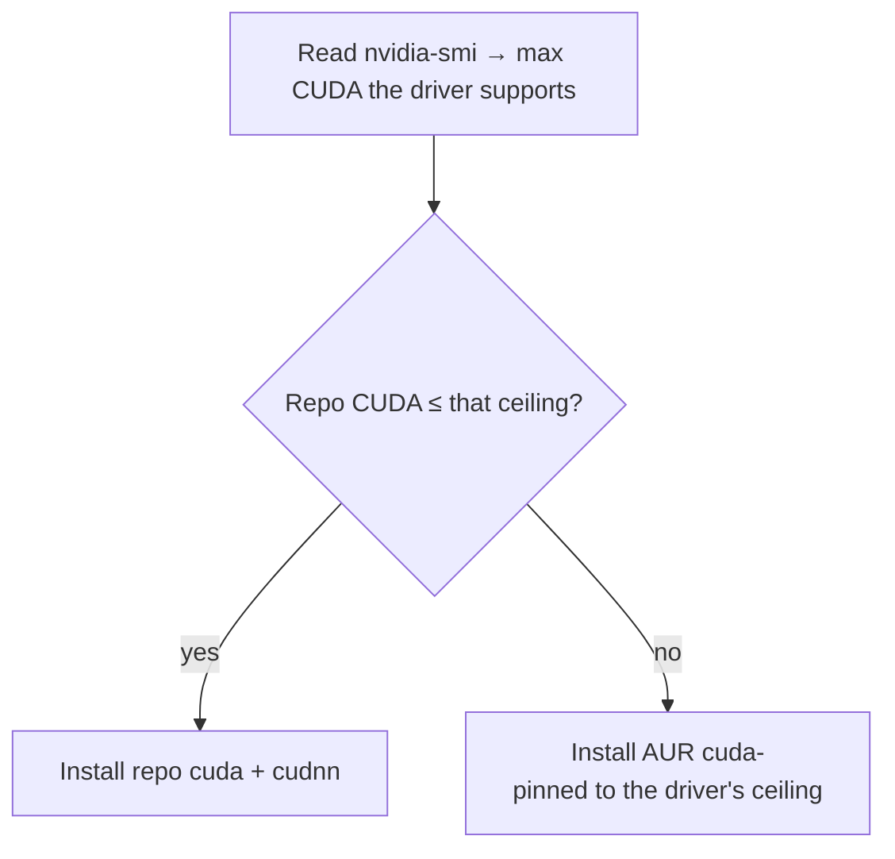

# The developer environment

**Goal of this page:** understand how this machine is set up for development —
especially the GPU/CUDA toolchain and Python — and the philosophy behind *which*
tools get installed where.

This box is a robotics / ML / embedded development machine, so the dev setup is
substantial. The [install reference](../reference.md#6-installed-software)
lists every package; this page explains the *reasoning*.

## CUDA, matched to the driver

[Recall from the NVIDIA page](05-nvidia.md#what-cuda-is): your installed driver
sets a **ceiling** on which CUDA version can run. Install a CUDA newer than the
driver supports and it simply won't work.

Arch's repo `cuda` package is *rolling* — always the newest CUDA, which may need
a newer driver than you have. So the install script is clever about it:



This means a fresh install gets a *working* CUDA automatically, instead of the
newest one that might fail to load. **cuDNN** (NVIDIA's deep-learning primitives
library) is installed alongside. The PATH is wired so `nvcc` and friends are
found in both login shells and fish. The exact logic is in
[`install_cuda`](08-reproducibility.md).

> **Minor-version compatibility — the ceiling is a *major*-version rule.** A
> CUDA **13.2** toolkit runs fine on a driver that maxes out at **13.0**, because
> CUDA guarantees that a newer-*minor* toolkit works on an older-minor driver of
> the **same major** (13.x). So after switching the driver to 580 (whose ceiling
> is 13.0), there's no need to downgrade the 13.2 toolkit — `nvidia-switch.sh
> cuda` only swaps CUDA when the *major* version exceeds the ceiling. (An earlier
> over-aggressive version *did* try to force 13.0 and removed `opencl-nvidia` —
> a driver component — in the process; the lesson: don't fight the package
> manager for a minor version that's already compatible.)

## Python: system, venv, or conda?

Python on Linux has a famous footgun: the OS itself uses Python, so installing
packages globally with `pip` can break system tools. There are three sane
approaches, and this machine uses a mix deliberately:

| Approach | What it is | Used here for |
|---|---|---|
| **System packages** | `pacman -S python-numpy ...` — distro-packaged libs | The everyday scientific stack (numpy, scipy, pandas, scikit-learn, jupyter), so they're managed by pacman like everything else |
| **venv** | A lightweight per-project virtual environment (`python -m venv`) | Isolating a single project's dependencies |
| **Anaconda / conda** | A separate Python distribution with its own package manager + environments | General ML/Python work needing its own toolchains, kept independent of the system Python |

!!! note "Why both system packages and Anaconda?"
    The system stack (via pacman) keeps common libraries fast to install and
    centrally updated. **Anaconda** is installed separately for ML workflows that
    want their own isolated environments and binary toolchains — it's wired into
    fish via `conda init`, but configured **not** to auto-activate its `base`
    environment (so your shell doesn't silently start inside conda). You opt in
    with `conda activate`. Anaconda is general-purpose here; it is *not* tied to
    any one project (the abandoned Isaac Sim attempt once used conda, but
    Anaconda outlived it).

## The package philosophy

A glance at the [installed software](../reference.md#6-installed-software)
shows the categories: build tools (clang, cmake, ninja, gdb), the Python stack,
Node, editors (Neovim, Zed, VS Code), embedded/serial tools (picocom,
arduino-cli, openocd), GPU/gaming (gamemode, mangohud), KDE settings apps,
display inspection tools, and a few AUR apps (browsers, claude-desktop, the
cursor theme).

Two principles guide what's installed:

1. **Prefer official repos; reach for the AUR only when needed.** Repo packages
   are curated and binary; AUR packages are community recipes built locally.
   Everyday tools come from the repos; the AUR fills gaps (proprietary browsers,
   `anaconda`, theme tweaks).

2. **Everything installable is also cleanly removable.** Because the system is
   [scripted](08-reproducibility.md), each capability you add has a matching
   uninstall path. That's how the entire Docker/Isaac/ROS stack was later removed
   without leaving cruft — and why CUDA, Anaconda, etc. are individual
   *components* you can add or strip one at a time.

## Editors and the binary-name gotcha

A small but recurring Linux annoyance: a package's name and its **command** name
can differ. Zed installs as `zeditor` (not `zed`); Mission Center as
`missioncenter` (no hyphen). When something "isn't found," check the actual
binary with `which <name>`. The [keybinds
reference](../keybinds.md#package-name-vs-binary-name-gotcha) keeps a list of the
confirmed mismatches on this system.

## Robotics: Isaac Sim & ROS 2

This machine runs **NVIDIA Isaac Sim** + **Isaac Lab** (robotics simulation) and
**ROS 2 Jazzy** (the robotics middleware). Two very different install strategies,
for good reasons:

- **Isaac Sim / Lab — native.** They need the GPU's full RTX renderer, which
  talks straight to the kernel driver. The only thing that ever blocked Isaac
  here was the *driver version* (it needs the 580 branch; see
  [NVIDIA → the fix](05-nvidia.md#the-fix-switch-the-whole-nvidia-stack-to-the-validated-driver)).
  Once the host is on 580 + `linux-lts`, Isaac runs natively.
- **ROS 2 Jazzy — a container.** Arch isn't an officially supported ROS 2
  platform, and ROS pins to specific Ubuntu releases. Rather than fight that on a
  rolling distro, ROS 2 runs in the official `osrf/ros:jazzy-desktop-full`
  container, launched by the `ros2-jazzy` helper. The
  [NVIDIA Container Toolkit](glossary.md) injects the **host** driver (580) into
  the container, so `--gpus all` gives ROS GPU access without installing anything
  ROS-related on the host.

### How the two talk to each other (the bridge)

ROS 2 nodes find each other over **DDS** (a peer-to-peer pub/sub protocol). For
native Isaac (on the host) and the Jazzy *container* to share topics, three
things must line up — and the `ros2-jazzy` launcher sets all three:

| Requirement | Why | How the launcher does it |
|---|---|---|
| Same network namespace | DDS discovery uses UDP on localhost | `--network host` |
| Shared memory | Fast DDS moves big messages (images, point clouds) via `/dev/shm` | `--ipc host` |
| Same domain + RMW | nodes only see peers with the same `ROS_DOMAIN_ID` and DDS vendor | `-e ROS_DOMAIN_ID` + `-e RMW_IMPLEMENTATION=rmw_fastrtps_cpp` |

Then, on the Isaac side, you enable its **ROS 2 Bridge** extension
(`isaacsim.ros2.bridge`). With matching domain/RMW, topics Isaac publishes show
up inside `ros2-jazzy shell` via `ros2 topic list`, and vice-versa.

> **Gotcha — every host NVIDIA library must match the driver version.** The
> Container Toolkit injects host NVIDIA libraries into the container *by the
> driver's version string* (e.g. `libnvidia-gtk3.so.580.119.02`). If even one
> NVIDIA package is left at a different version, `docker --gpus all` fails to
> start with *"open …so.580.119.02: no such file or directory"*. This bit us:
> `nvidia-settings` (which ships `libnvidia-gtk3` / `libnvidia-wayland-client`)
> was left at **595** after the driver moved to **580** — so the toolkit looked
> for the 580 file that didn't exist. The fix (now built into
> `nvidia-switch.sh`): the driver swap includes **and pins `nvidia-settings`** too,
> so the *whole* stack — module, userspace, and the settings libs — stays on one
> version.

> **Gotcha 2 — CDI vs the open driver: force legacy mode.** The Container Toolkit
> has two ways to find host GPU files: the older **legacy** path
> (`libnvidia-container`, which lists only files that exist) and the newer **CDI**
> path (a generated `/etc/cdi/nvidia.yaml` spec). In the default `mode = "auto"`,
> if a CDI spec exists it's used. But `nvidia-ctk cdi generate` lists libraries
> the **open** driver doesn't ship (e.g. `libnvidia-tileiras.so.<ver>`), so the
> spec points at a non-existent file and `--gpus all` dies with *"no such file"*.
> Fix: force the legacy path —
> `sudo nvidia-ctk config --in-place --set nvidia-container-runtime.mode=legacy`
> (the `docker` install component now does this automatically). The legacy path
> still injects everything rviz needs for GPU rendering.

```bash
ros2-jazzy pull            # fetch the image once (~6 GB → /home/docker-data)
ros2-jazzy shell           # drop into a Jazzy environment; ~/robotics/ws is /root/ws
ros2-jazzy run "ros2 topic list"   # one-off command
```

Everything large lives on **/home** (the container image store is
`/home/docker-data`, the workspace is `~/robotics/ws`) because the root partition
is small — see [Reproducibility](08-reproducibility.md).

---

**Next:** [Reproducibility & the scripts →](08-reproducibility.md) — how this
whole machine rebuilds itself.
