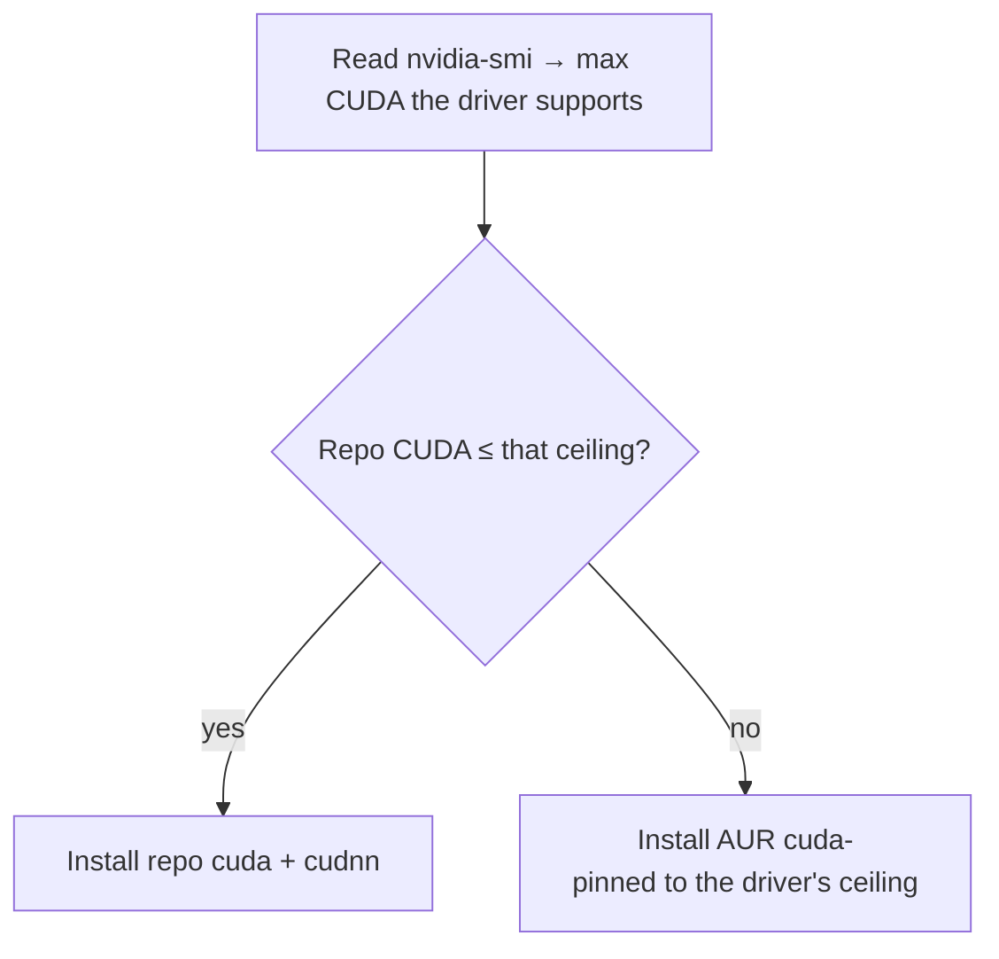

# The developer environment

**Goal of this page:** understand how this machine is set up for development —
especially the GPU/CUDA toolchain and Python — and the philosophy behind *which*
tools get installed where.

This box is a robotics / ML / embedded development machine, so the dev setup is
substantial. The [install reference](../reference.md#6-installed-software)
lists every package; this page explains the *reasoning*.

## CUDA, matched to the driver

[Recall from the NVIDIA page](05-nvidia.md#what-cuda-is): your installed driver
sets a **ceiling** on which CUDA version can run. Install a CUDA newer than the
driver supports and it simply won't work.

Arch's repo `cuda` package is *rolling* — always the newest CUDA, which may need
a newer driver than you have. So the install script is clever about it:

This means a fresh install gets a *working* CUDA automatically, instead of the
newest one that might fail to load. **cuDNN** (NVIDIA's deep-learning primitives
library) is installed alongside. The PATH is wired so `nvcc` and friends are
found in both login shells and fish. The exact logic is in
[`install_cuda`](08-reproducibility.md).

## Python: system, venv, or conda?

Python on Linux has a famous footgun: the OS itself uses Python, so installing
packages globally with `pip` can break system tools. There are three sane
approaches, and this machine uses a mix deliberately:

| Approach | What it is | Used here for |
|---|---|---|
| **System packages** | `pacman -S python-numpy ...` — distro-packaged libs | The everyday scientific stack (numpy, scipy, pandas, scikit-learn, jupyter), so they're managed by pacman like everything else |
| **venv** | A lightweight per-project virtual environment (`python -m venv`) | Isolating a single project's dependencies |
| **Anaconda / conda** | A separate Python distribution with its own package manager + environments | General ML/Python work needing its own toolchains, kept independent of the system Python |

!!! note "Why both system packages and Anaconda?"
    The system stack (via pacman) keeps common libraries fast to install and
    centrally updated. **Anaconda** is installed separately for ML workflows that
    want their own isolated environments and binary toolchains — it's wired into
    fish via `conda init`, but configured **not** to auto-activate its `base`
    environment (so your shell doesn't silently start inside conda). You opt in
    with `conda activate`. Anaconda is general-purpose here; it is *not* tied to
    any one project (the abandoned Isaac Sim attempt once used conda, but
    Anaconda outlived it).

## The package philosophy

A glance at the [installed software](../reference.md#6-installed-software)
shows the categories: build tools (clang, cmake, ninja, gdb), the Python stack,
Node, editors (Neovim, Zed, VS Code), embedded/serial tools (picocom,
arduino-cli, openocd), GPU/gaming (gamemode, mangohud), KDE settings apps,
display inspection tools, and a few AUR apps (browsers, claude-desktop, the
cursor theme).

Two principles guide what's installed:

1. **Prefer official repos; reach for the AUR only when needed.** Repo packages
   are curated and binary; AUR packages are community recipes built locally.
   Everyday tools come from the repos; the AUR fills gaps (proprietary browsers,
   `anaconda`, theme tweaks).

2. **Everything installable is also cleanly removable.** Because the system is
   [scripted](08-reproducibility.md), each capability you add has a matching
   uninstall path. That's how the entire Docker/Isaac/ROS stack was later removed
   without leaving cruft — and why CUDA, Anaconda, etc. are individual
   *components* you can add or strip one at a time.

## Editors and the binary-name gotcha

A small but recurring Linux annoyance: a package's name and its **command** name
can differ. Zed installs as `zeditor` (not `zed`); Mission Center as
`missioncenter` (no hyphen). When something "isn't found," check the actual
binary with `which <name>`. The [keybinds
reference](../keybinds.md#package-name-vs-binary-name-gotcha) keeps a list of the
confirmed mismatches on this system.

---

**Next:** [Reproducibility & the scripts →](08-reproducibility.md) — how this
whole machine rebuilds itself.
