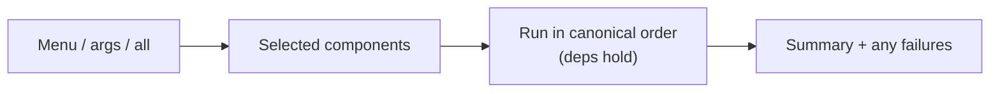

# Reproducibility & the scripts

**Goal of this page:** understand the philosophy that ties this whole project
together — that the entire machine can be **rebuilt from scripts**, cleanly
**removed** by scripts, and that *every* change flows back into those scripts so
the documentation never drifts from reality.

This is arguably the most important idea on the site. The fancy desktop is nice;
the *reproducibility* is what makes it maintainable.

## The problem reproducibility solves

The naive way to set up Linux is to install things by hand, edit configs in
place, and apply fixes ad-hoc in the terminal. Six months later you have a
working machine that **nobody — including you — knows how to recreate.** If the
disk dies or an update breaks things, you're rebuilding from memory.

The cure: treat the setup as **code**. Three scripts in the repo can rebuild or
remove the system, and they are the *source of truth* — not the live files.

| Script | Job | Sudo? |
|---|---|---|
| `setup-home.sh` | Writes the home-directory half: Hyprland overrides, `~/.local/bin` helper scripts, fish config, the Sweet GTK icon theme (nautilus), the DualSense WirePlumber rule, git defaults | No |
| `install.sh` | The system half: packages (repo + AUR), driver-matched CUDA, the DualSense audio pin + udev rule, groups, the fish login shell | Yes (calls `sudo` itself) |
| `uninstall.sh` | The clean counterpart: remove a component's packages **and** its data, configs, and launchers, and report the space reclaimed | Yes |

## Idempotency — safe to run again

A script is **idempotent** if running it twice does no harm — the second run
notices what's already done and skips it. All three scripts are built this way:

- package installs use `pacman -S --needed` (skip already-installed),
- config writers overwrite to a known-good state,
- fixes are **self-limiting** — e.g. the PipeWire pin only acts if it *detects*
  the bad version, so it's a no-op on a healthy machine,
- failures are recorded in a list and reported at the end rather than aborting
  the whole run.

Idempotency is what lets you re-run a script after a partial failure, or to apply
just one new change, without fear.

## The component model

All three scripts share one shape: a list of named **components**, each a small
function. Run a script with no arguments and you get an **interactive menu**; or
name components directly; or preview without changing anything:

```bash
bash install.sh                  # interactive menu — pick what to install
bash install.sh cuda audio       # just those components
bash install.sh --dry-run all    # show everything it WOULD do; touch nothing
bash uninstall.sh docker isaac   # remove components cleanly
```

The same `--dry-run`, `--yes`, and `all` flags work everywhere. `install.sh`
always runs its prerequisites first (database refresh, git/`gh`/an AUR helper),
then the components you chose, in a fixed dependency-safe order.



This mirrors how you *think* about the machine — "I want CUDA and audio" — and
makes adding a feature mechanical: a new row in the `COMPONENTS` list plus a
`do_<name>()` function.

## Clean uninstall — "as if never installed"

A real test of reproducibility is **removal**. `uninstall.sh` doesn't just
`pacman -R` a package; for each component it removes the packages, deletes the
data directories, configs, and launcher scripts, and reports how much disk it
freed. Two subtleties it gets right (learned the hard way):

- It measures root-owned paths with `sudo du`. A normal-user `du` can't read
  inside a root-owned directory (like Docker's data store) and would report ~0,
  making it *look* like nothing was freed when tens of GB actually were.
- It removes container-owned caches (files owned by an in-container user ID) with
  `sudo`, or they'd survive with "permission denied."

This is exactly how the entire **Docker + Isaac Sim + ROS** stack was removed
when [Isaac proved unworkable](05-nvidia.md#case-study-2-isaac-sim-and-a-bug-a-container-couldnt-fix) —
one command, packages and tens of gigabytes of images gone, the scripts and docs
updated to match.

## The roaming-SSD trick

The same NVMe boots two machines. Reproducibility here means **detecting** the
hardware rather than hard-coding it:

- `setup-home.sh` detects the connected monitor at setup time and writes the
  desktop monitor config for *whatever* connector it finds (DP-1, HDMI-A-1, …).
- A login script, `select-monitors.sh`, checks on every boot whether a laptop
  panel (`eDP-1`) is connected and flips a symlink to the right per-host monitor
  file. Laptops have a built-in panel; desktops don't — so the *presence of
  hardware* is the reliable signal, no hostname needed.

The [display setup page](../display.md#why-a-symlink-and-a-script) explains the
mechanism in full.

## The standing habit

The thread tying it together is a deliberate discipline (recorded in the
project's memory so it survives across sessions):

!!! tip "Every change flows back into the scripts"
    After any fix or new feature: **fold it into the scripts** (never leave a
    one-off `/tmp` hack), **make it robust** (idempotent, self-limiting),
    **update the docs** (including this learning site), **update memory**, and
    **push**. A clean reinstall must reproduce the *fixed* system, and a clean
    uninstall must leave no trace. That habit is why this documentation matches
    the machine instead of describing a system that no longer exists.

The repo map and the full habit are on the [project context
page](../project-context.md).

---

**Next:** [The troubleshooting mindset →](09-troubleshooting-mindset.md) — how to
debug Linux instead of guessing.
