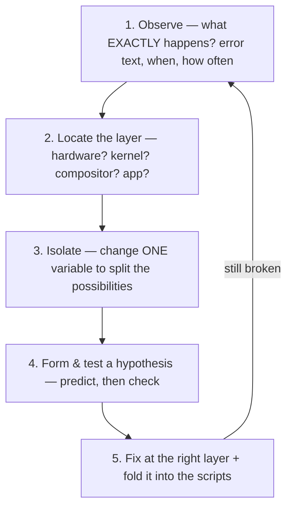

# The troubleshooting mindset

**Goal of this page:** learn *how to debug* a Linux system, not just memorise
fixes. Specific fixes go stale; the method doesn't. This page distils the way the
problems elsewhere on this site were actually solved.

## Why a method matters

The beginner instinct is to **search the error, paste a random command, hope**.
Sometimes it works; often it makes things worse and teaches you nothing. A
systematic approach is faster *and* leaves you understanding your machine.

The core technique is **isolate the layer**. Recall the
[layer stack](index.md#the-core-idea-linux-is-assembled-not-pre-built): hardware →
kernel → services → Wayland → Hyprland → caelestia → apps. Almost every problem
lives in *one* layer. Find which, and you've eliminated 90% of the search space.

## The five-step loop

1. **Observe precisely.** "Audio's broken" is useless. "The DualSense *speaker*
   went silent right after a `pacman -Syu`, but other devices work" points
   almost directly at the cause.
2. **Locate the layer.** Is the GPU even seen (`nvidia-smi`)? Does the kernel see
   the device (`drm_info`, `dmesg`)? Does the compositor (`hyprctl monitors`)? Or
   is it just one app? Each tool inspects a different layer.
3. **Isolate by changing one variable.** This is the heart of it — see below.
4. **Hypothesise and test.** Predict what you'd see if your guess were right,
   then look. If the prediction fails, the guess was wrong — move on, don't pile
   on more changes.
5. **Fix at the correct layer**, then [fold the fix into the
   scripts](08-reproducibility.md) so it survives a rebuild.

## Isolation testing — the key skill

To tell two explanations apart, change **exactly one thing** so the result rules
one out. Worked examples from this machine:

### The DualSense jack (hardware vs software)

Symptom: 3.5mm jack silent. Possible causes: bad earphones, PipeWire routing,
the controller hardware. Isolate:

- Earphones **on a phone** → work. *Rules out the earphones.*
- The controller **speaker** → works. *Rules out the whole USB-audio path being
  dead.*
- `speaker-test` driving the DAC **directly, bypassing PipeWire** → still
  silent. *Rules out PipeWire/routing.*

Only the controller's headphone output stage is left → **hardware fault**, stop
debugging software. Each test changed one variable and eliminated one layer. Full
story: [Audio page](06-audio.md#case-study-the-dualsense-controllers-audio).

### Isaac Sim (userspace vs kernel)

Symptom: 3D renderer crashes. The fix for "Arch userspace mismatch" is a
container (frozen userspace). Isolate by **running it in a container** — if that
fixes it, it was userspace; if not, it's deeper. It *didn't* fix it → the bug is
in the **kernel** driver, which a container can't replace → abandon the approach.
One decisive test saved endless userspace fiddling. Full story:
[NVIDIA page](05-nvidia.md#case-study-2-isaac-sim-and-a-bug-a-container-couldnt-fix).

### The ghost cursor (input vs renderer)

Symptom: a stuck cursor. Obvious guess: an input device. Isolate by **disabling
every input device** — the cursor *survived*. That single test proved it was
*not* input at all, redirecting the search to the NVIDIA renderer, where the real
fix lay. Full story:
[NVIDIA page](05-nvidia.md#case-study-1-the-ghost-cursor).

!!! tip "The pattern"
    In all three, the *obvious* explanation was wrong, and one well-chosen test
    exposed it. When stuck, ask: "What single observation would prove my current
    guess wrong?" Then go make that observation.

## A toolbox by layer

Reach for the tool that inspects the layer you suspect:

| Layer | Question | Tools |
|---|---|---|
| Hardware / kernel | Does Linux even see it? | `dmesg`, `lspci`, `lsusb`, `drm_info`, `/sys/class/...` |
| GPU driver | Driver loaded? CUDA ceiling? | `nvidia-smi`, `pacman -Qs nvidia` |
| Audio | Devices, routing, defaults | `wpctl status`, `pactl list`, `speaker-test`, `alsamixer` |
| Display / compositor | What is Hyprland doing now? | `hyprctl monitors`, `hyprctl binds`, `wlr-randr` |
| Packages | What's installed / what changed? | `pacman -Q`, `pacman -Qi`, the pacman log in `/var/log/pacman.log` |
| Logs | What did it say when it broke? | `journalctl -b` (this boot), `journalctl --user -u <svc>` |

## Rolling-release specific habits

Because [Arch updates continuously](01-arch-and-pacman.md#the-rolling-release-bargain),
a class of problems is "an update broke X":

- **Suspect the most recent update.** `/var/log/pacman.log` shows exactly what
  changed and when. If a thing broke "today," what upgraded today?
- **Pin to roll back.** If a new version regressed, downgrade from the package
  cache (`/var/cache/pacman/pkg/`) and add `IgnorePkg` so the next upgrade can't
  re-pull it — exactly what the [PipeWire fix](06-audio.md#problem-a-the-speaker-went-silent-a-software-regression)
  does. Remove the pin once upstream ships a fix.
- **Know that newest ≠ working.** That's the deal you took; the tools above make
  it manageable.

## When to stop

Sometimes the right answer is "this can't be fixed at this layer" — a hardware
fault (the DualSense jack) or a driver bug you won't patch (Isaac on driver 595).
Recognising a dead end *is* a successful diagnosis: it stops you sinking hours
into the wrong layer. Document the conclusion (so future-you doesn't re-litigate
it) and move on.

The exhaustive, copy-pasteable fixes for this specific machine live in the
[Full Reference → Troubleshooting](../reference.md#8-troubleshooting-recipes).

---

That's the conceptual Learning Path. One practical appendix follows — the
[**package-management cheat-sheet →**](10-package-management.md) (the everyday
pacman / yay / Flatpak commands). After that, the [Full Reference](../reference.md)
is your manual, and the [project scripts](../project-context.md) are how you rebuild
it all. Unsure of a term? The [Glossary](glossary.md) has you covered.
